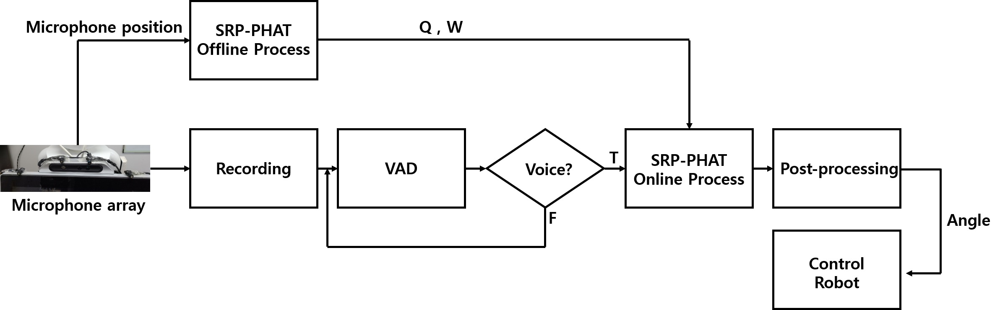

# sound-source-localization using SRP-PHAT
---
Project : Sound source localization + voice activity detection on Robot platform  

Sound source localization algorithm : SRP-PHAT (https://en.wikipedia.org/wiki/Steered-Response_Power_Phase_Transform)  
Voice activity detection algorithm : webrtcvad (https://github.com/wiseman/py-webrtcvad)  

# Demo
---
The robot follows smartphone that plays human voice.  
It also can follow human voice.

# Robot & Environments
---
The robot is FURo-D model(http://www.futurerobot.co.kr/).  
Environments  
> Windows10 (OS)  
> Python (VAD & SSL algorithm)  
> C# (Control robot)  

# Flowchart
---

# Dependency
---
matplotlib  
numpy  
webrtcvad  
librosa

# Usage
---
1. Setup microphone array (In my case, 4 microphones are used) and measure microphone position.
2. Modify offline.py (microphone position and Q array setting)
3. Run offline.py
4. Modify utils.py (input_device_index=your_usb_device_num @ audio_record function)
5. Run main.py
6. Now you can send rotation-angle to localhost:1234(robot controller)

## IF you want to use SRP-PHAT algorithm only, use offline.py and srp_phat function in main.py

# Contact
---
Gwantae Kim (gtkim@ispl.korea.ac.kr, kgt1103211@gmail.com)
